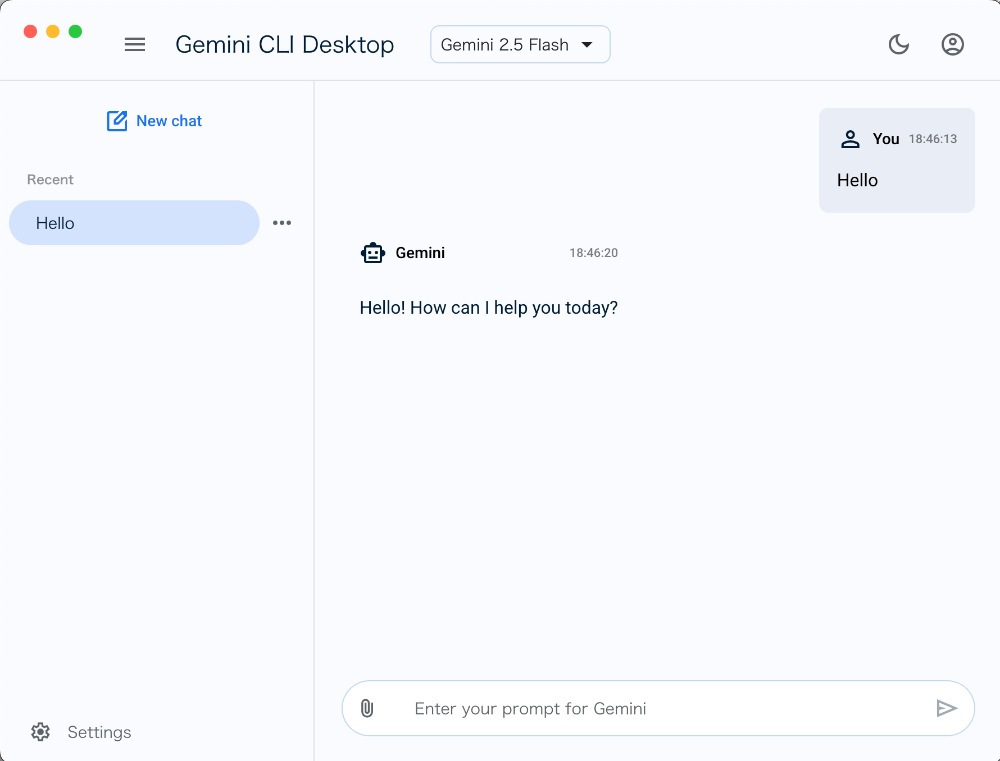

# Gemini CLI Desktop

A desktop application that provides a graphical user interface for Google's Gemini AI, featuring MCP (Model Context Protocol) integration and tool approval system.



## Overview

Gemini CLI Desktop is a fork and desktop GUI wrapper of [Google's Gemini CLI](https://github.com/google-gemini/gemini-cli). While the original Gemini CLI provides a powerful command-line interface for interacting with Gemini AI, this project extends it by:

- Adding a native desktop application using Electron
- Providing an intuitive graphical user interface with Material Design 3
- Implementing a comprehensive tool approval system for enhanced security
- Offering visual MCP server management

This project maintains compatibility with the core Gemini CLI functionality while making it more accessible to users who prefer graphical interfaces over command-line tools.

## Features

- **Chat Interface**: Clean, modern chat UI with support for:
  - Conversation history
  - Multiple chat sessions
  - Real-time streaming responses
  - Thought visualization (shows Gemini's reasoning process)

- **MCP Server Integration**: Easily manage and connect to MCP servers:
  - Add/remove MCP servers with custom configurations
  - Start/stop servers directly from the UI
  - Support for environment variables and custom arguments

- **Tool Approval System**: Enhanced security with tool execution approval:
  - Review and approve tool executions before they run
  - Whitelist trusted tools for automatic execution
  - Keyboard shortcuts for quick approval (Enter/Esc/Shift+Enter)

- **Multiple Authentication Methods**:
  - Google OAuth (personal accounts)
  - Gemini API Key
  - Vertex AI integration

- **Material Design 3**: Modern UI following Google's Material Design guidelines

## Installation

### Prerequisites

- Node.js 20 or higher
- npm or yarn

### Build from Source

```bash
# Clone the repository
git clone https://github.com/yudppp/gemini-cli-desktop.git
cd gemini-cli-desktop

# Install dependencies
npm install

# Start the application in development mode
npm run dev:desktop

# Or build for production
npm run build:desktop
```

## Usage

### First Run

1. Launch the application
2. Choose your authentication method:
   - **OAuth**: Sign in with your Google account
   - **API Key**: Enter your Gemini API key from [Google AI Studio](https://aistudio.google.com/apikey)
   - **Vertex AI**: Use Google Cloud credentials

3. Start chatting with Gemini!

### MCP Server Setup

1. Navigate to Settings → MCP Servers
2. Click "Add Server"
3. Configure your MCP server:
   - Name: Display name for the server
   - Command: The command to run (e.g., `npx`)
   - Arguments: Command arguments (e.g., `@modelcontextprotocol/server-filesystem`)
   - Environment variables (optional)

4. Click "Start" to connect to the server

### Tool Approval

All tools require approval before execution to ensure safety. When Gemini attempts to use a tool:

1. An approval dialog will appear showing:
   - Tool type and name
   - What the tool will do
   - For file edits: the changes to be made
   - For commands: the command to be executed

2. You can:
   - **Execute (Enter)**: Run the tool once
   - **Always Allow (Shift+Enter)**: Add to whitelist for automatic execution
   - **Cancel (Esc)**: Deny the execution

### Managing Approved Tools

Navigate to Settings → Tool Approval to view and manage your whitelist of approved tools.

## Configuration

Configuration files are stored in:

- **macOS**: `~/Library/Application Support/@gemini-cli-desktop/desktop/`
- **Windows**: `%APPDATA%/@gemini-cli-desktop/desktop/`
- **Linux**: `~/.config/@gemini-cli-desktop/desktop/`

## Development

### Project Structure

```
packages/
├── desktop/          # Electron desktop application
│   ├── src/
│   │   ├── main/     # Main process (Electron)
│   │   ├── renderer/ # Renderer process (React)
│   │   └── services/ # Core services
│   └── dist/         # Built application
└── core/            # Gemini CLI core (submodule)
```

### Technologies Used

- **Electron**: Desktop application framework
- **React**: UI framework
- **TypeScript**: Type safety
- **Material Web Components**: UI components
- **Vite**: Build tool

## Contributing

Contributions are welcome! Please feel free to submit issues and pull requests.

## License

This project is licensed under the Apache License 2.0 - see the LICENSE file for details.

## Acknowledgments

This project is built on top of [Google's Gemini CLI](https://github.com/google-gemini/gemini-cli) and uses the Model Context Protocol for tool integration.
